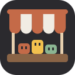
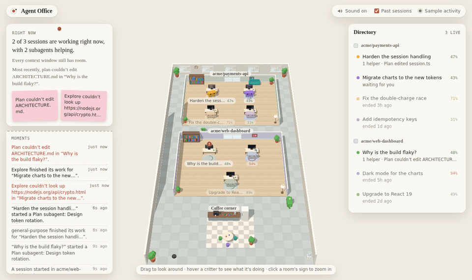
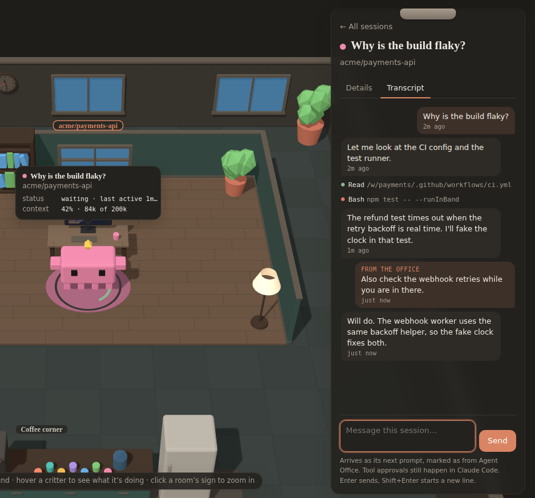

# ModsArena

Claude Code mods and the tools around them.
<br clear="left">

##  Agent Office

A live office of everything Claude Code is doing on your machine. Each project gets its own cozy room. Your chat sessions are colorful critters, each at its own desk whose monitor scrolls code while it works. Each subagent is a smaller critter standing behind the session that started it, and every tool call makes its caller hop. A pinned notice says what's happening, sticky notes flag what needs a look, and a directory lists every session by room. Click any critter to read its conversation as it happens and send it a message, without leaving the office.

**[Try the demo in your browser](https://tharun-se95.github.io/ModsArena/)**: sample activity, nothing to install.



### Quick start

You need Claude Code and [Node](https://nodejs.org) 18 or newer. In Claude Code:

```
/plugin marketplace add tharun-se95/ModsArena
/plugin install agent-office@modsarena
```

Then type **`/office`**. It starts the office's bridge if it isn't running and opens the office in your browser. Every Claude Code session on your machine, in any project, joins the same office. That's all.

- Click a critter, then **Transcript**, to follow its conversation and message it. See [Talk to your agents](#talk-to-your-agents).
- `/office status` says whether the bridge is running, what it has seen, and what this session is doing.
- `/office` appears once a session has started and the plugin's hooks are running. Where it isn't listed (before the first message in the desktop app, or anywhere the hooks don't run), the `agent-office:office` skill opens the office instead.
- `claude plugin marketplace update modsarena` fetches new versions.
- The status line shows `◉ office N agents · M tools` while work is in flight.

<details>
<summary><b>Your Claude Code doesn't have mods?</b> Use settings hooks instead.</summary>

Older Claude Code builds can't load the plugin's hooks. Settings hooks get most of the picture: sessions, prompts, subagents, tool calls, and context from the transcript after each turn. The `/context` breakdown, per-subagent context, cost and rate limits need the plugin, and so does sending messages: transcripts still show, but the message box can't deliver.

```sh
npx github:tharun-se95/ModsArena install-hooks   # adds the hooks to ~/.claude/settings.json (backed up first)
npx github:tharun-se95/ModsArena                 # starts the bridge and opens the office; leave it running
```

New Claude Code sessions report to it. `install-hooks --project` writes to `./.claude/settings.json` instead, `--port N` picks another port, and `uninstall-hooks` removes exactly what it added. Each hook pipes its input to the bridge with `curl`, waits at most a second, and never blocks or fails a tool call.
</details>

<details>
<summary><b>Just want to look?</b> Run the demo locally.</summary>

```sh
npx github:tharun-se95/ModsArena demo            # sample activity on http://127.0.0.1:7338
```
</details>

### Troubleshooting

| You see | Do this |
| --- | --- |
| `/office` says Node is missing or too old | Install Node 18 or newer from [nodejs.org](https://nodejs.org), then run `/office` again. |
| "The bridge didn't answer" | Something else may be using port 7337. Run `/office status`, or pick another port with `/plugin configure agent-office@modsarena` (option `port`). |
| The page opens but the office is empty | It fills in as sessions work. Sessions that started before the bridge appear from their next event; past sessions from the last 14 days show as sleeping critters (tick **Past sessions**). |
| The browser didn't open | Open the address `/office` printed, normally http://127.0.0.1:7337. |
| No sound | Browsers only allow sound after you click the page once. Check the **Sound** button in the top bar. |
| A message says "Waiting for the session to pick it up" | The session doesn't have the plugin loaded (settings hooks can't receive messages), or it has ended. Messages are picked up within a second by a session running the plugin. |
| A message says "Queued as the next prompt" but nothing happens | The session is mid-turn; it reads your message as soon as that turn ends. |
| Plugin options say "not yet set" | The defaults (port 7337, start the bridge automatically) are fine; you only need to set them to change them. |

### What you're looking at

| In the office | What it is |
| --- | --- |
| The office | Carpet tiles, outer walls with tall windows, plants that sway, a water cooler and a robot vacuum doing laps of the open floor, all around the rooms. The windows follow your local time (dawn, day, golden hour, dusk, night), the lamps glow brighter after dark, and the wall clock shows the time. The floor arranges itself to fill your window. |
| Coffee corner | A shared kitchenette: a counter with a steaming coffee machine and a row of mugs, a fridge, and a round table with stools. Finished subagents walk here along the aisles, pick up a mug, take a few sips, and then head off. |
| Room | A project: a git repository (worktrees included) or a folder outside one. Each room has a wooden floor, walls in its own color, and furniture (a bookshelf, a window, plants, a lamp, sometimes a couch). What a room holds and its wall color come from the project's name, so it always looks the same. Its sessions sit in a small grid. Click the sign over the back wall to zoom in, and press Esc to see every room again. |
| Critter on a rug, with a gold gem | A live chat session, named by its first prompt. Each session gets its own color. Its desk's monitor scrolls code while it works, dims while it waits, and is off for past sessions. Its legs patter while it works, and the gem glows and spins faster. It hops on each prompt and each tool call, and it turns toward the subagent that acted last. |
| Ring on the rug around it | How full that context window is: green, then amber past 60%, then red past 85%. A pulsing red ring, and both arms up, mean it's past 80% and will compact soon. |
| Smaller critters behind its desk | Subagents, standing in a row behind the desk (then a second row, then either side), so they never overlap. Each type has its own color and build: **Explore** is sky blue, low and wide, with a periscope; **Plan** is lilac and tall on two legs, with a cap; **code-reviewer** is pink and wears glasses; **test-runner** is mustard with six legs and antennae; and **general-purpose** is the plain green critter. Your own agent types get a color from their name. They drop in when started (the session waves hello), and when finished they wave goodbye and walk to the coffee corner. |
| Grey critter with closed eyes | A past session from the last 14 days, read from its transcript. Each room shows the three most recent, and its sign counts the rest. Untick **Past sessions** to hide them. |
| Bead rising off a critter | A tool call, colored by what it does: reads sky blue, edits coral, searches green, web lookups lilac, shell commands mustard, handoffs teal. A red bead means the call failed. |
| Ripple across the rug | The session just compacted its context. |
| A session walking in | A session that starts while you watch walks in from the front of the office to its desk. |
| Confetti | The session just finished a turn. |
| Red "!" and a wobble | A tool call just failed. |
| "zzz" | A session that's been idle for two minutes has dozed off, and past sessions are asleep. |
| Steam over a desk mug | That session is working right now. |
| A wave | Two critters passing each other on the way in or to coffee say hi. |

**Sounds:** soft key taps when a tool runs, a two-note chime when a turn finishes, a bonk when a call fails, a pop when a helper arrives, a chirp when critters wave, a clink at the coffee corner and a hush on compaction. They're synthesized in the browser (no audio files), start after your first click or key press, and the **Sound** button in the header mutes them (it remembers your choice).

Hover any critter (or its line in the directory) for a bubble with what it is and what it's doing: its status, the tool it's running, its context use, model and tool calls, and who it works for. Session names and room signs stay small and quiet; a name that would collide with another, with a sign or with the bubble steps aside. Click a critter, a sticky note or a directory line and the camera glides to its room while the directory turns into a clipboard with its details:

- its context use and what fills it (the `/context` breakdown);
- turns, tool calls, errors, cost, model and rate limits;
- who is helping now, the files it has read and edited, its recent actions in plain words, and what you asked it.

Floating over the office (and framed around, so the office always sits in the space they leave free):

- **The notice card** (top left) says what's going on in a sentence or two, with a sticky note for each thing that **needs a look**: yellow for a context window past 80%, pink for a call that just failed.
- **The tape** (bottom left) keeps the moments: subagents starting and finishing, failures, compactions.
- **The directory** (right) lists sessions by room, each room marked with its wall color, with context use and what each session is up to. Picking one clips it to a clipboard with its details; **All sessions** or Esc puts it back and glides out to the whole office.

On a narrow screen the notice card becomes a strip under the top bar and the directory a sheet at the bottom.

### Talk to your agents

Open a critter's clipboard and switch to **Transcript**: its conversation, live. Your prompts sit on the right and its replies on the left. Tool calls are one line each, green or red once they finish; click one to see what came back. It's read from the transcript Claude Code keeps, so past sessions and subagents have one too.

The box at the bottom sends it a message:

- **To a session:** the message becomes its next prompt, marked as from Agent Office. If the session is mid-turn, it waits until that turn ends.
- **To a subagent:** the message goes to that subagent directly. A finished one is resumed to answer, which uses tokens.
- **Past sessions** show their transcript but no message box. Resume one in Claude Code to talk to it again.

Enter sends and Shift+Enter starts a new line.



The message stays on the clipboard with its status until it shows up in the transcript, and the reply appears below it. Tool approvals still pop up in Claude Code itself: chat can't do anything your permission settings don't already allow. It needs the plugin; the settings-hooks fallback can't receive messages. In the demo, messages get a sample reply.

**How it's kept safe.** The bridge only listens on `127.0.0.1`, but any web page you visit can send requests there, so:

- **Host check:** every request must be addressed to the bridge itself. This stops a page pointing its own hostname at your machine to read the answers (DNS rebinding).
- **Origin check:** browser requests that change anything must come from the office page.
- **Token:** sending a message also needs a secret token the bridge makes fresh each time it starts and gives only to the office page.

### How each thing is measured

| What | Mod (live) | Settings hooks (fallback) | Past sessions |
| --- | --- | --- | --- |
| Project | `$.session.repo()` root, named by the bridge from `origin` | git root of `cwd` | git root of the transcript's `cwd` |
| Session context | `session.measure` (live), `turn.step` (every request) | transcript tail on each `Stop` | last main-loop request in the transcript |
| What fills it | `$.session.usage({ breakdown })` after each turn | no | no |
| Subagent context | `turn.step` inside the agent's loop | no | `subagents/*.jsonl` |
| Compactions | `session.compact`, with tokens before and after | `PreCompact` | `compact_boundary` rows |
| Cost and rate limits | `session.measure` | no | the transcript's `cost-state` row |

A request's context is what it was answered over: uncached input plus cache reads plus cache writes. The transcripts don't record the window size, so the bridge reads 1M for models with `[1m]` in their id or for any reading past 200k, and 200k otherwise.

### How it works

```
Claude Code ──(mod hooks / settings hooks)──► bridge :7337 ──(SSE)──► the office (browser, Three.js)
~/.claude/projects/*/*.jsonl ─────────────────►   └─ GET /history
```

- **`agent-office/`** is the Claude Code plugin (a mod), listed in this repository's marketplace (`.claude-plugin/marketplace.json`). It hooks `session.start`, `session.measure`, `session.compact`, `turn.step`, `turn.start`, `turn.complete`, `agent.spawn` and `tool.call`. Every tool call is attributed to the agent loop that made it (`agentId`), and every subagent to its parent (`parentAgentId`). Hooks run in a sandbox without Node, so events are queued in memory and flushed to the bridge every 250 ms with `$.http.fetch`. Context readings are coalesced so only the newest is sent, and a tool call never waits on the visualizer. On session start the mod also starts the bridge (`$.process.spawn`) if none is running, and `/office` waits for it before opening the page.
- **`agent-office/server/`** is the bridge, plus `cli.mjs` (what `npx github:tharun-se95/ModsArena` runs) and `settings-hooks.mjs` (the settings-hooks installer). It uses only Node built-ins and has no dependencies. It accepts events on `POST /event` and keeps the last 8,000, plus the newest context reading per session and agent. It streams them to browsers over Server-Sent Events and replays the backlog when a browser connects. `GET /history` summarizes recent transcripts, cached by file modification time. `GET /transcript` follows one session's or subagent's transcript from a byte offset (`transcript.mjs`). `POST /chat` queues a message from the office, and the session's mod collects it from `GET /inbox` (`chat.mjs`, with the checks in `guard.mjs`). One bridge serves every session on the machine. It strips any credentials from remote URLs before showing them.
- **`visualizer/`** is the page's source, in plain Three.js: `model.js` turns events into projects, sessions, agents and tools; `words.js` turns the same events into sentences; `table.js` lays out the office and animates the critters (`office.js` builds the rooms, desks, coffee corner and office shell; `character.js` builds each critter); and `panels.js` writes the columns around it. Colors come from CSS tokens on the page, so it follows your light or dark setting. It's built into `agent-office/server/public/app.js`, which is committed, so running it needs only Node; CI checks the committed file matches its source.

### Options

The plugin has two options. Change them with `/plugin configure agent-office@modsarena`, or under `pluginConfigs` in settings:

| Option | Default | |
| --- | --- | --- |
| `port` | `7337` | The port the bridge listens on |
| `autoStart` | `true` | Start the bundled bridge when none answers |

The bridge on its own: `node agent-office/server/server.mjs [--port 7337] [--history-days 14] [--demo]`.

### Develop

```sh
git clone https://github.com/tharun-se95/ModsArena && cd ModsArena
claude --plugin-dir ./agent-office               # load the plugin from your checkout
cd visualizer && npm install && npm run build    # rebuild the page (or: npm run watch)
claude plugin validate .                         # the marketplace
claude plugin validate agent-office              # the plugin, as the engine will load it
claude plugin test agent-office                  # mod tests (hooks/register.test.ts)
node --test agent-office/server/*.test.mjs       # bridge and CLI: schema, history, projects, settings hooks
node scripts/build-demo-site.mjs                 # the hosted demo, into site/
```

CI (`.github/workflows/ci.yml`) runs all of these on every pull request. `.github/workflows/pages.yml` publishes the demo to GitHub Pages from `main`. To release: bump `version` in `agent-office/.claude-plugin/plugin.json`, `.claude-plugin/marketplace.json` (both places) and both `package.json` files, add a `CHANGELOG.md` section, merge, then either tag `main` (`git tag v0.2.1 && git push origin v0.2.1`) or run **Actions → Release → Run workflow** on `main`, which creates the tag itself. `.github/workflows/release.yml` checks the tag against every manifest (`node scripts/version.mjs check`) and publishes a GitHub Release with that section as its notes; `marketplace update` picks the new version up.

The bridge's event schema is documented at the top of `agent-office/server/normalize.mjs`. Any other producer, such as an OpenTelemetry receiver, can `POST` the same shapes.

## License

[MIT](LICENSE)
