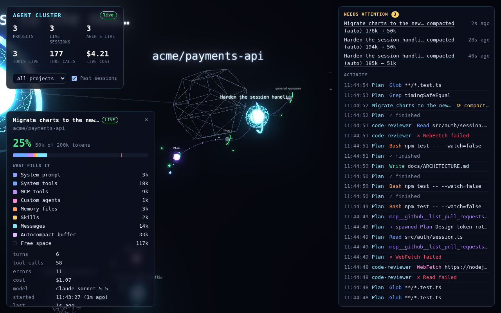

# ModsArena

Claude Code mods and the tools around them.

## Agent Cluster 3D

A live 3D view of everything Claude Code is doing on your machine. Each project is a cluster. Inside it are your chat sessions, live and recent. Sessions spawn subagents, agents run tools, and every session and agent wears a ring that shows how full its context window is.



| On screen | What it is |
| --- | --- |
| Faint wireframe shape with a big label | A project: a git repository (worktrees included) or a folder outside one. |
| Cyan core with a wireframe shell | A live chat session, named by its first prompt. It pulses on each prompt. |
| Small grey-blue core | A past session from the last 14 days, read from its transcript. |
| Segmented ring around a session | Its context window, split by what fills it: system prompt, tools, MCP tools, memory files, skills, messages. The empty part is free space. |
| Colored satellites | Subagents (`Explore`, `Plan`, your own agent types, teammates), linked to whoever spawned them. Finished ones dim. |
| Ring around a satellite | That agent's own context fill: green, then amber past 60%, then red past 85%. |
| Red pulsing halo | A session or agent past 80% of its window. |
| White ring bursting outward | A compaction just happened. |
| Small crystals | Tool calls in flight, colored by family. They flash green or red when done, then fold away. |

**Two views.** The **overview** shows every project as one node with its sessions around it, plus a one-line status: live sessions, running agents, and the fullest context window. The node turns red when any session is over 80%. Click a project, or pick it in the top-left menu, to open its **project view**: that project alone, with its live sessions in a row (a column on a tall screen), past sessions in a smaller row beneath, each session's subagents on a ring around it, and tool calls right beside whoever runs them. **← All projects** or Esc goes back.

**Two cameras.** Switch with **2.5D / 3D** in the header, or press V. **2.5D** looks down at the layout at an angle, as onto a floor with a grid. Dragging pans and scrolling zooms, so the picture never turns over, which suits a monitor left running. **3D** looks at the layout head-on and lets you orbit freely. Your choice is remembered in this browser.

Nothing moves by itself. Every node has a fixed place, and a new session or agent takes the next free place without moving the others. Finished agents fade out after 20 seconds and stay listed on their session. On a phone the activity panel folds into a one-line bar, so the view gets the screen.

Click any node to open its details:

- **Session:** context meter, the `/context` breakdown, turns, tool calls, errors, cost, model, rate limits, compactions, running and finished subagents, and every prompt with its time.
- **Agent:** its context meter, type, model, tools done, who spawned it, and its compactions.
- **Project:** every live and past session, with context fill and last activity.

The header totals always match the view you're in.

The right column lists what **needs attention** (anything over 80%, and compactions from the last few minutes; click one to jump to it), then the live activity feed.

### How each thing is measured

| What | Mod (live) | Settings hooks (fallback) | Past sessions |
| --- | --- | --- | --- |
| Project | `$.session.repo()` root, named by the bridge from `origin` | git root of `cwd` | git root of the transcript's `cwd` |
| Session context | `session.measure` (live), `turn.step` (every request) | transcript tail on each `Stop` | last main-loop request in the transcript |
| What fills it | `$.session.usage({ breakdown })` after each turn | no | no |
| Subagent context | `turn.step` inside the agent's loop | no | `subagents/*.jsonl` |
| Compactions | `session.compact`, with tokens before and after | `PreCompact` | `compact_boundary` rows |
| Cost and rate limits | `session.measure` | no | the transcript's `cost-state` row |

A request's context is what it was answered over: uncached input plus cache reads plus cache writes. The transcripts don't record the window size, so the bridge reads 1M for models with `[1m]` in their id or for any reading past 200k, and 200k otherwise.

### How it works

```
Claude Code ──(mod hooks / settings hooks)──► bridge :7337 ──(SSE)──► browser (Three.js)
~/.claude/projects/*/*.jsonl ─────────────────►   └─ GET /history
```

- **`agent-cluster-3d/`** is the Claude Code mod. It hooks `session.start`, `session.measure`, `session.compact`, `turn.step`, `turn.start`, `turn.complete`, `agent.spawn` and `tool.call`. Every tool call is attributed to the agent loop that made it (`agentId`), and every subagent to its parent (`parentAgentId`). Hooks run in a sandbox without Node, so events are queued in memory and flushed to the bridge every 250 ms with `$.http.fetch`. Context readings are coalesced so only the newest is sent, and a tool call never waits on the visualizer. On session start the mod also starts the bridge (`$.process.spawn`) if none is running.
- **`agent-cluster-3d/server/`** is the bridge. It uses only Node built-ins and has no dependencies. It accepts events on `POST /event` and keeps the last 8,000, plus the newest context reading per session and agent. It streams them to browsers over Server-Sent Events and replays the backlog when a browser connects. `GET /history` summarizes recent transcripts, cached by file modification time. One bridge serves every session on the machine. It strips any credentials from remote URLs before showing them.
- **`visualizer/`** is the page's source: [3d-force-graph](https://github.com/vasturiano/3d-force-graph), Three.js and bloom, split into `model.js`, `scene.js` and `hud.js`. It's built into `agent-cluster-3d/server/public/app.js`, which is committed, so running it needs only Node.

### Run it

**As a mod (recommended).** This needs a Claude Code build with mods (function-hook plugins).

```sh
claude --plugin-dir ./agent-cluster-3d
```

Then type `/cluster3d` in the session to open the visualizer (http://127.0.0.1:7337). The status line shows `◉ cluster N agents · M tools` while work is in flight. Start more sessions the same way, in any project, and they all join the same view.

The mod has two options under `pluginConfigs` in settings, which you can also change from the config menu:

| Option | Default | |
| --- | --- | --- |
| `port` | `7337` | The port the bridge listens on |
| `autoStart` | `true` | Start the bundled bridge when none answers |

**With plain settings hooks (any Claude Code version).** Start the bridge yourself:

```sh
node agent-cluster-3d/server/server.mjs
```

Then merge `agent-cluster-3d/fallback/settings.json` into `~/.claude/settings.json`. It pipes each hook's stdin to the bridge with `curl`, waiting at most one second, and it never blocks or fails a tool call. Subagents come from `SubagentStart`/`SubagentStop`, tool calls are attributed through the hooks' `agent_id`, and session context is read from the transcript after each turn. The breakdown, per-agent context, cost and rate limits need the mod.

**Demo, no Claude Code needed:**

```sh
node agent-cluster-3d/server/server.mjs --demo
# open http://127.0.0.1:7337
```

Bridge options: `--port 7337` and `--history-days 14`. Add `?bloom=0` to the page URL to turn off the glow on slower GPUs.

### Develop

```sh
cd visualizer && npm install && npm run build   # or: npm run watch
claude plugin validate agent-cluster-3d          # what the engine will load
claude plugin test agent-cluster-3d              # mod tests (hooks/register.test.ts)
node --test agent-cluster-3d/server/*.test.mjs   # bridge: schema, history, projects
```

The bridge's event schema is documented at the top of `agent-cluster-3d/server/normalize.mjs`. Any other producer, such as an OpenTelemetry receiver, can `POST` the same shapes.
